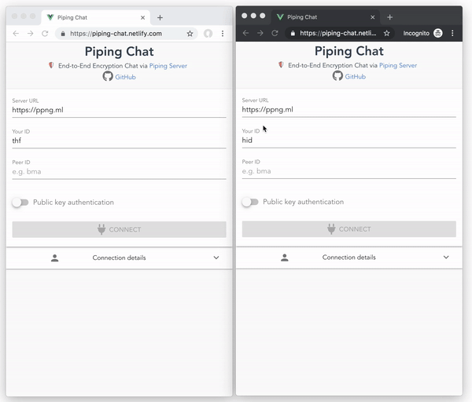

# piping-chat
  
 

End-to-End Encryption Chat via [Piping Server](https://github.com/nwtgck/piping-server)

## Application
Piping Chat: <https://piping-chat.netlify.com>

## Purpose & Features
The main purpose of Piping Chat allows users chat safely via Piping Server. It has the following features for the purpose.

* End-to-End Encryption by AES [GCM](https://en.wikipedia.org/wiki/Galois/Counter_Mode)
* [Forward Secrecy](https://en.wikipedia.org/wiki/Forward_secrecy) by [ECDH](https://en.wikipedia.org/wiki/Elliptic-curve_Diffie%E2%80%93Hellman)
* Public Key Authentication like SSH
* via [Piping Server](https://github.com/nwtgck/piping-server)
* Static hosting
* Progressive Web App (PWA)
* Accountless

## End-to-End Encryption + Public Key Authentication

Here is a demo to use Public Key Authentication. The public RSA PEM is used **only for authentication**, not for encryption. You can also use RSA PEM generated by `openssl` command.

